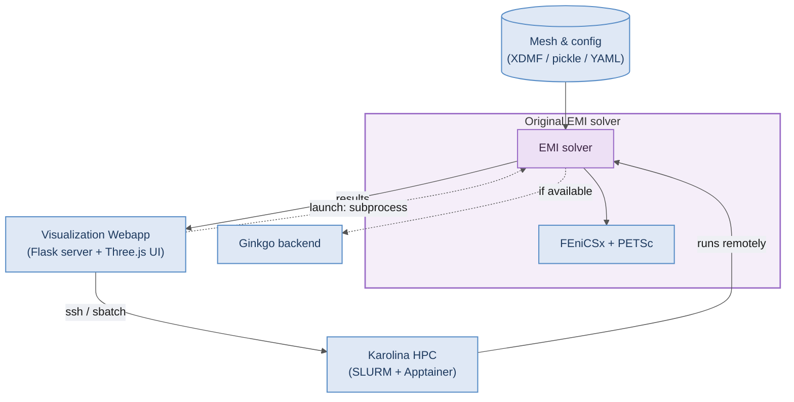

# cardioEMI Architecture

The repository started as the EMI solver shown in [solver.md](solver.md). Everything outside the highlighted "Original EMI solver" group below was added around that core: mesh preparation tools, a Flask + Three.js viz layer, a GPU solver backend, and remote-execution glue.

## Layer summary

| Layer | Path | Role |
|---|---|---|
| **Original solver** | `main.py`, `utils.py`, `ionic_model.py`, `*_assembly.py`, `mesh_partition.py` | FEniCSx + multiphenicsx EMI assembly and time stepping (zoom in: [solver.md](solver.md)) |
| Mesh prep | `geometry/` | XDMF + tags + pickle generation, coloring, component partitioning |
| Ginkgo backend | `dolfinx-ginkgo/` | Optional GPU linear solver (CUDA / HIP / SYCL / OMP) |
| Flask bridge | `viz/server.py` | REST API: meshes, config, run simulation (subprocess + SSE), results, cross-sections, interfaces |
| Browser UI | `viz/index.html`, `viz/js/` | Three.js mesh viewer, simulation/solver/Karolina/results UI |
| Viz scripts | `viz/scripts/` | Post-process solver output → JSON for browser, export MP4 |
| Remote | `viz/karolina.py`, Apptainer SIF | SLURM job submission and monitoring on Karolina HPC (zoom in: [remote_execution.md](remote_execution.md)) |
