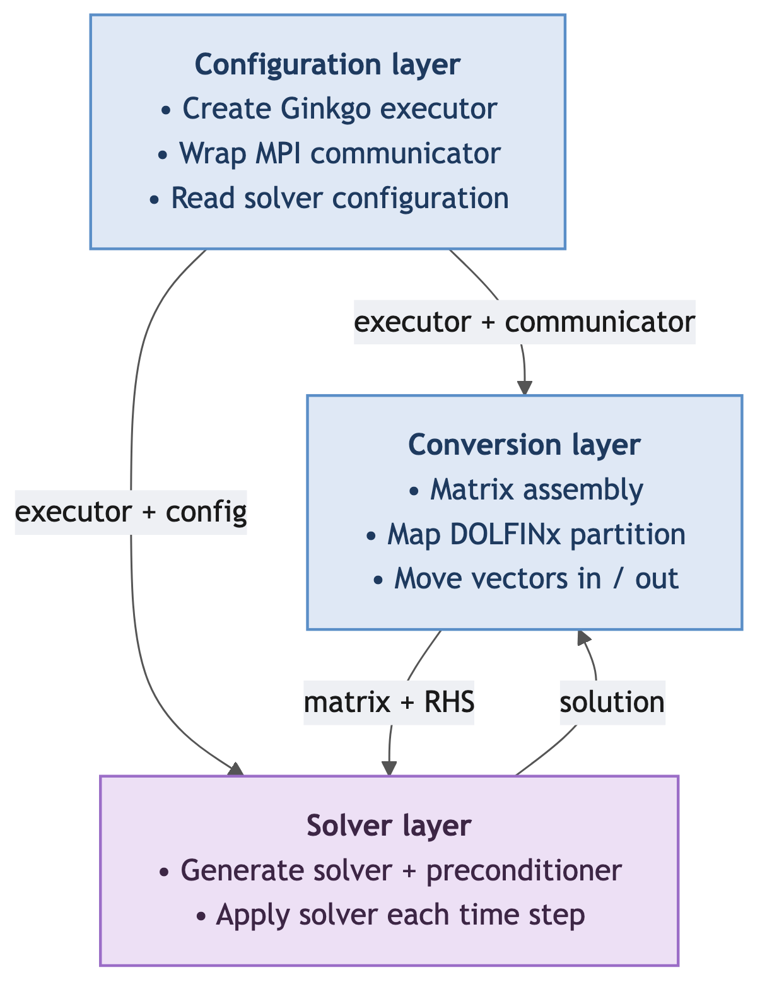
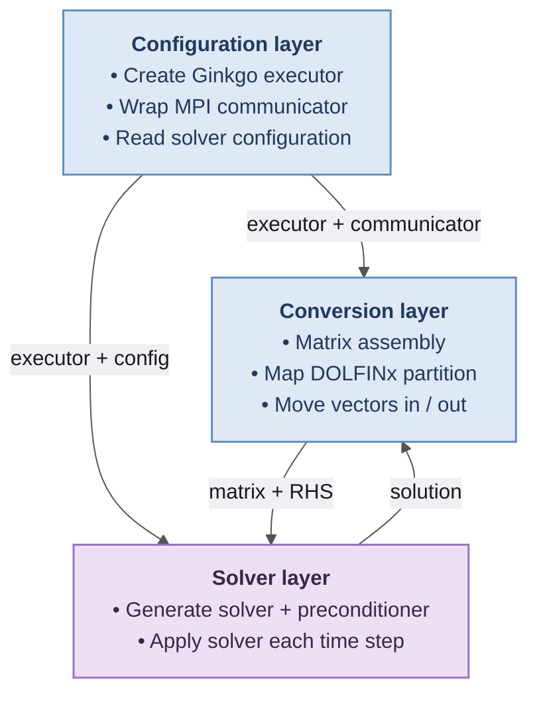

# dolfinx-ginkgo — C++ core layers

Zoom-in on the header-only C++ core (`dolfinx-ginkgo/cpp/dolfinx_ginkgo/`) from
the dolfinx-ginkgo section of [building_blocks.md](building_blocks.md). It turns
the DOLFINx/PETSc system into Ginkgo's distributed objects and runs the solve on
the chosen device, organised into three layers.

## How they interact

The **Configuration** layer hands its executor and communicator to the
**Conversion** layer (so matrices and vectors are built on the right device) and
its executor + config to the **Solver** layer. The **Conversion** layer feeds the
assembled operator and RHS into the **Solver**, which runs the iteration and
passes the solution back out through Conversion to PETSc. The Python
`GinkgoSolver` sits above all three, selecting options and shuttling the system
in and the answer out.
