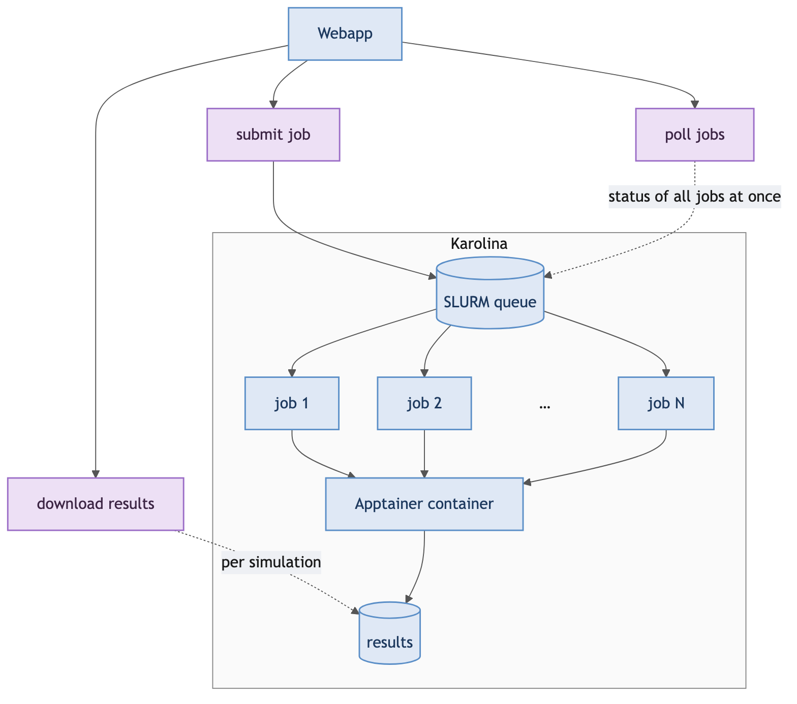
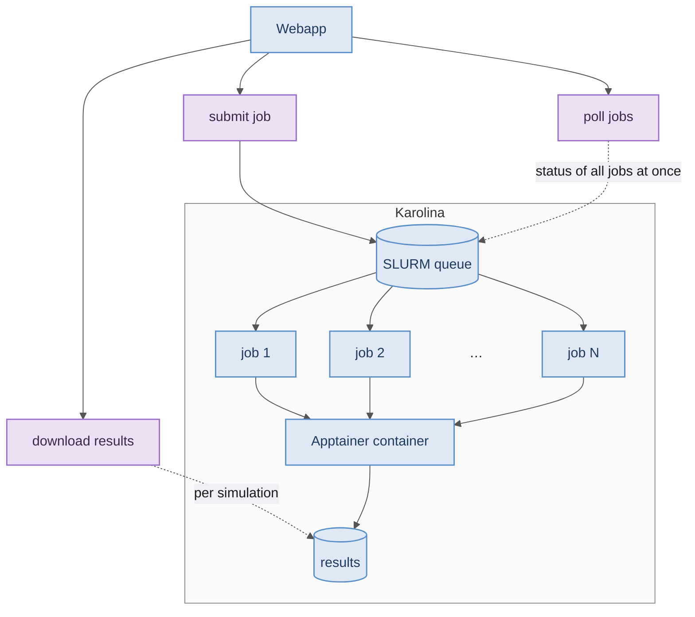

# Remote execution on Karolina

Zoom-in on the **Karolina HPC** block from [architecture.md](architecture.md).
The webapp submits runs to the cluster, watches them in the SLURM queue and
pulls the results back — all of it plain `ssh` / `scp` calls to the `karolina`
host alias.

**Submitting.** Each run gets its own remote directory holding its config and a
generated SLURM script, which is then `sbatch`ed. The script runs cardioEMI under
Apptainer via `srun`. A comma-separated node count (`1,2,4`) submits one job per
value in a single batch — the usual way to launch a scaling sweep.

**Polling.** A background thread checks every tracked job every 5 s with one
batched `squeue`/`sacct` call, so cost stays flat no matter how many jobs are
queued. The UI reads that cached state, and jobs drop out once they finish.

**Downloading.** Results come back as a single streamed `tar.gz` with byte
progress, or — for just the convergence plots — as the pickles alone.
