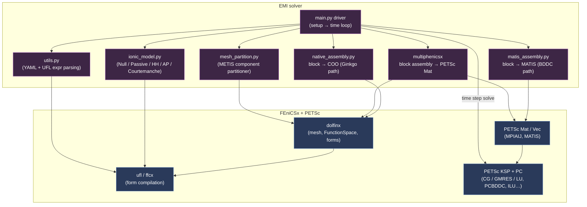

# EMI Solver Internals

Zoom-in on the **EMI solver** and **FEniCSx + PETSc** blocks from [architecture.md](architecture.md).

```mermaid
graph TB
    subgraph SOLVER["EMI solver"]
        DRIVER["main.py driver<br/>(setup → time loop)"]
        INPUT["utils.py<br/>(YAML + UFL expr parsing)"]
        MESH["mesh_partition.py<br/>(METIS component partitioner)"]
        IONIC["ionic_model.py<br/>(Null / Passive / HH / AP / Courtemanche)"]
        ASM_PETSC["multiphenicsx<br/>block assembly → PETSc Mat"]
        ASM_NATIVE["native_assembly.py<br/>block → COO (Ginkgo path)"]
        ASM_MATIS["matis_assembly.py<br/>block → MATIS (BDDC path)"]
    end

    subgraph BACKEND["FEniCSx + PETSc"]
        DOLFINX["dolfinx<br/>(mesh, FunctionSpace, forms)"]
        UFL["ufl / ffcx<br/>(form compilation)"]
        PETSCMAT["PETSc Mat / Vec<br/>(MPIAIJ, MATIS)"]
        KSP["PETSc KSP + PC<br/>(CG / GMRES / LU, PCBDDC, ILU…)"]
    end

    DRIVER --> INPUT
    DRIVER --> MESH
    DRIVER --> IONIC
    DRIVER --> ASM_PETSC
    DRIVER --> ASM_NATIVE
    DRIVER --> ASM_MATIS
    DRIVER -->|time step solve| KSP

    INPUT --> UFL
    MESH --> DOLFINX
    IONIC --> UFL
    ASM_PETSC --> DOLFINX
    ASM_PETSC --> PETSCMAT
    ASM_NATIVE --> DOLFINX
    ASM_MATIS --> PETSCMAT
    DOLFINX --> UFL
    PETSCMAT --> KSP

    classDef core fill:#3d2645,color:#fff,stroke:#b06ac7
    classDef backend fill:#2a3a5a,color:#fff,stroke:#6a8ec7
    class DRIVER,INPUT,MESH,IONIC,ASM_PETSC,ASM_NATIVE,ASM_MATIS core
    class DOLFINX,UFL,PETSCMAT,KSP backend
```
